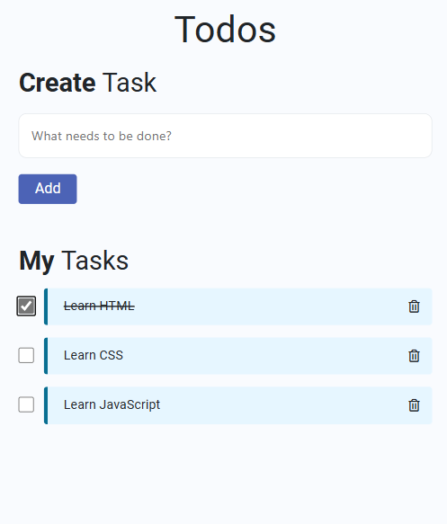

# 📝 Todo List Application



Welcome to the Todo List Application repository! This project is a simple, interactive, and responsive Todo List built using HTML, CSS, and JavaScript. It helps users keep track of their tasks by allowing them to add, mark as complete, and delete tasks.

## 📚 Table of Contents

- [Introduction](#introduction)
- [Features](#features)
- [Technologies Used](#technologies-used)
- [Installation](#installation)
- [Usage](#usage)
- [Screenshots](#screenshots)
- [Contributing](#contributing)
- [Contact](#contact)

## 📝 Introduction

This project is a basic Todo List application that showcases fundamental web development skills. The app allows users to add new tasks, mark tasks as completed, and delete tasks. The project demonstrates how to manipulate the DOM, handle events, and dynamically update the UI.

## ✨ Features

- Add new tasks
- Mark tasks as completed
- Delete tasks
- Responsive design using Bootstrap

## 🛠️ Technologies Used

- **HTML**: Structure of the web pages
- **CSS**: Styling the application
- **JavaScript**: Making the application interactive
- **Bootstrap**: Responsive design and styling

## 🚀 Installation

To run this project locally, follow these steps:

1. **Clone the repository:**

   ```sh
   git clone https://github.com/Ganeshmoorthii/Todo-Application.git

2. Navigate to the project directory:
    ```sh
    cd Todo-Application
    ```

## 💻 Usage

1. **Add a new task:**
   - Type your task in the input field and click the "Add" button.

2. **Mark a task as completed:**
   - Click the checkbox next to the task you want to mark as completed.

3. **Delete a task:**
   - Click the trash icon next to the task you want to delete.

## 🤝 Contributing

Contributions are welcome! If you have any suggestions or improvements, feel free to fork this repository and create a pull request.

1. Fork the repository
2. Create a new branch (`git checkout -b feature-branch`)
3. Commit your changes (`git commit -m 'Add some feature'`)
4. Push to the branch (`git push origin feature-branch`)
5. Open a pull request

## 📬 Contact

Feel free to reach out if you have any questions or suggestions!

- **Email**: mgmoorthi2004@gmail.com
- **LinkedIn**: [My LinkedIn Profile](https://www.linkedin.com/in/m-ganesh-moorthi-903798258/)

